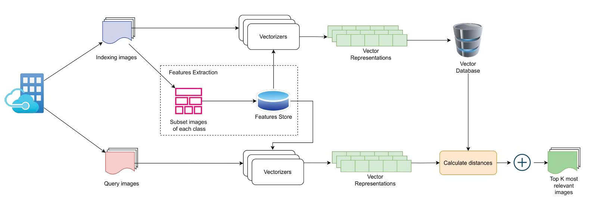
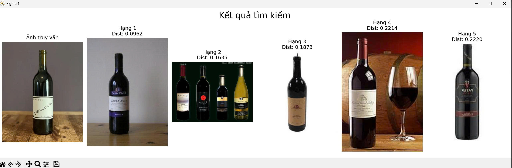
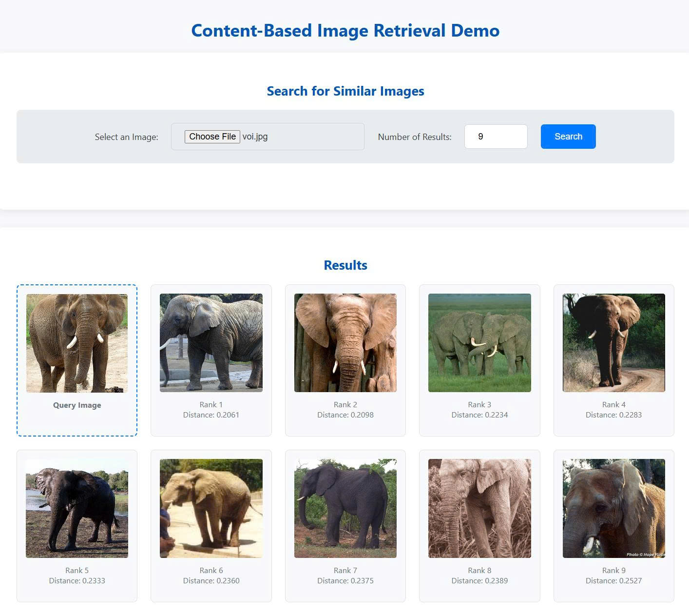

# Content-Based Image Retrieval with Caltech-256 Dataset

A Content-Based Image Retrieval (CBIR) system using ResNet-50, ChromaDB, and a FastAPI web interface.



<<<<<<< Updated upstream
## Install dependencies:
    ```bash
    pip install -r requirements.txt
    ```
=======
## Install dependencies
```bash
pip install -r requirements.txt
```
>>>>>>> Stashed changes

## Dataset Setup

1.  Download the Caltech-256 dataset from the official source: [256_ObjectCategories.tar](http://www.vision.caltech.edu/Image_Datasets/Caltech256/256_ObjectCategories.tar).
2.  Create a `data` directory in the project root.
3.  Extract the downloaded archive. The final path to the image folders should be:
    `./data/caltech-256/256_ObjectCategories/`

## Usage

This project uses FastAPI to provide a web interface and API endpoints for the CBIR system.
### 1. Indexing ( Run only one time)
```bash
python index_resnet50_cbir.py
```
This script will scan the dataset, extract features, and save them to the `chroma_db` directory. 

### 2. Run app

```bash
uvicorn main:app 
```
The server will be available at `http://127.0.0.1:8000`.


From the web interface, you can select an image from your computer, specify the number of results, and see the most similar images from the dataset.


<<<<<<< Updated upstream
-   **To specify the number of results:**
    Use the `--n_results` argument to control how many similar images are returned.
    ```bash
    python run_resnet50_cbir.py --mode search --query_image "/path/to/your/image.jpg" --n_results 10
    ```

Search results, including the query image and its closest matches, will be displayed in a Matplotlib window.

## DEMO

=======
## DEMO Screenshot

>>>>>>> Stashed changes
